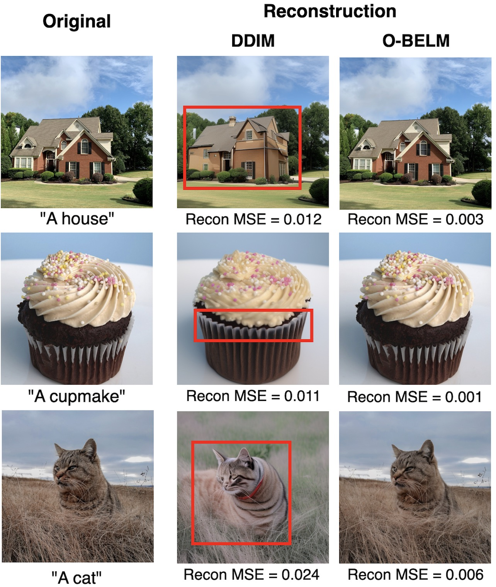
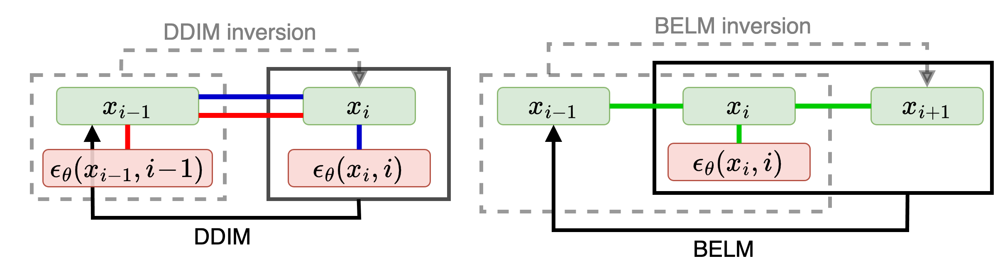
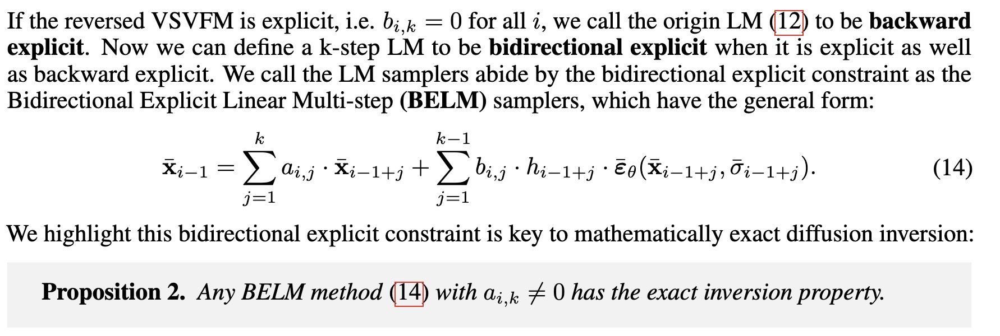
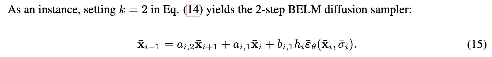
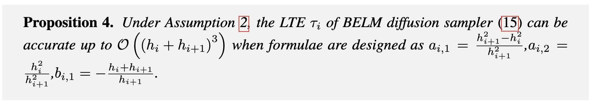

# BELM: High-quality Exact Inversion sampler of Diffusion Models 🏆

<div align="center">

This repository is the official implementation of the **NeurIPS 2024** paper:
_"BELM: Bidirectional Explicit Linear Multi-step Sampler for Exact Inversion in Diffusion Models"_ 

Keywords: Diffusion Model, Exact Inversion, ODE Solver

> **Fangyikang Wang<sup>1</sup>, Hubery Yin<sup>2</sup>, Yuejiang Dong<sup>3</sup>, Huminhao Zhu<sup>1</sup>, <br> Chao Zhang<sup>1</sup>, Hanbin Zhao<sup>1</sup>, Hui Qian<sup>1</sup>, Chen Li<sup>2</sup>**
> 
> <sup>1</sup>Zhejiang University <sup>2</sup>WeChat, Tencent Inc. <sup>3</sup>Tsinghua University

[](https://arxiv.org/abs/2410.07273)&nbsp;
[](https://opensource.org/licenses/MIT)&nbsp;
[](https://zhuanlan.zhihu.com/p/1379396199)&nbsp;
[](https://hits.seeyoufarm.com)


</div>

<p align="center">
    
</p>


<!-- > Image Editing Results -->
<!-- > Images editing: -->

<!-- <p align="center"> 
     
<p> -->

<!-- > Interpolation Results -->

<!-- #### Image interpolation: -->
<!-- <p align="center"> 
     
<p> -->
<!-- ## Abstract

The inversion of diffusion model sampling, which aims to find the corresponding initial noise of a sample, plays a critical role in various tasks. Recently, several heuristic exact inversion samplers have been proposed to address the inexact inversion issue in a training-free manner. However, the theoretical properties of these heuristic samplers remain unknown and they often exhibit mediocre sampling quality. In this paper, we introduce a generic formulation, \emph{Bidirectional Explicit Linear Multi-step} (BELM) samplers, of the exact inversion samplers, which includes all previously proposed heuristic exact inversion samplers as special cases. The BELM formulation is derived from the variable-stepsize-variable-formula linear multi-step method via integrating a bidirectional explicit constraint. We highlight this bidirectional explicit constraint is the key of mathematically exact inversion. We systematically investigate the Local Truncation Error (LTE) within the BELM framework and show that the existing heuristic designs of exact inversion samplers yield sub-optimal LTE. Consequently, we propose the Optimal BELM (O-BELM) sampler through the LTE minimization approach. We conduct additional analysis to substantiate the theoretical stability and global convergence property of the proposed optimal sampler. Comprehensive experiments demonstrate our O-BELM sampler establishes the exact inversion property while achieving high-quality sampling. Additional experiments in image editing and image interpolation highlight the extensive potential of applying O-BELM in varying applications.  -->


## 🆕 What's New?
### 🔥 We use the thought of bidirectional explicit to enable exact inversion

> **Schematic description** of DDIM (left) and BELM (right). DDIM uses $`\mathbf{x}_i`$ and $`\boldsymbol{\varepsilon}_\theta(\mathbf{x}_i,i)`$ to calculate $`\mathbf{x}_{i-1}`$ based on a linear relation between $`\mathbf{x}_i`$, $`\mathbf{x}_{i-1}`$ and $`\boldsymbol{\varepsilon}_\theta(\mathbf{x}_i,i)`$ (represented by the <span style="color:blue">blue line</span>). However, DDIM inversion uses $`\mathbf{x}_{i-1}`$ and $`\boldsymbol{\varepsilon}_\theta(\mathbf{x}_{i-1},i-1)`$ to calculate $`\mathbf{x}_{i}`$ based on a different linear relation represented by the <span style="color:red">red line</span>. This mismatch leads to the inexact inversion of DDIM. In contrast, BELM seeks to establish a linear relation between $`\mathbf{x}_{i-1}`$, $`\mathbf{x}_i`$, $`\mathbf{x}_{i+1}`$ and $`\boldsymbol{\varepsilon}_\theta(\mathbf{x}_{i}, i)`$ (represented by the <span style="color:green">green line</span>). BELM and its inversion are derived from this unitary relation, which facilitates the exact inversion. Specifically, BELM uses the linear combination of $`\mathbf{x}_i`$, $`\mathbf{x}_{i+1}`$ and $`\boldsymbol{\varepsilon}_\theta(\mathbf{x}_{i},i)`$ to calculate $`\mathbf{x}_{i-1}`$, and the BELM inversion uses the linear combination of $`\mathbf{x}_{i-1}`$, $`\mathbf{x}_i`$ and $`\boldsymbol{\varepsilon}_\theta(\mathbf{x}_{i},i)`$ to calculate $`\mathbf{x}_{i+1}`$. The bidirectional explicit constraint means this linear relation does not include the derivatives at the bidirectional endpoint, that is, $`\boldsymbol{\varepsilon}_\theta(\mathbf{x}_{i-1},i-1)`$ and $`\boldsymbol{\varepsilon}_\theta(\mathbf{x}_{i+1},i+1)`$.

### 🔥 We introduce a generic formulation of the exact inversion samplers, BELM.
<!-- 
 -->
the general k-step BELM:
```math
\bar{\mathbf{x}}_{i-1} = \sum_{j=1}^{k} a_{i,j}\cdot \bar{\mathbf{x}}_{i-1+j} +\sum_{j=1}^{k-1}b_{i,j}\cdot h_{i-1+j}\cdot\bar{\boldsymbol{\varepsilon}}_\theta(\bar{\mathbf{x}}_{i-1+j},\bar{\sigma}_{i-1+j}).
```


2-step BELM:
```math
\bar{\mathbf{x}}_{i-1} = a_{i,2}\bar{\mathbf{x}}_{i+1} +a_{i,1}\bar{\mathbf{x}}_{i} + b_{i,1} h_i\bar{\boldsymbol{\varepsilon}}_\theta(\bar{\mathbf{x}}_i,\bar{\sigma}_i).
```

### 🔥 We derive the optimal coefficients for BELM via LTE minimization.
<!--  -->

<div style="background-color: #f0f0f0; padding: 10px; border-radius: 5px;">

> **Proposition**  The LTE $`\tau_i`$ of BELM diffusion sampler, which is given by $`\tau_i = \bar{\mathbf{x}}(t_{i-1}) - a_{i,2}\bar{\mathbf{x}}(t_{i+1}) -a_{i,1}\bar{\mathbf{x}}(t_{i}) - b_{i,1} h_i\bar{\boldsymbol{\varepsilon}}_\theta(\bar{\mathbf{x}}(t_i),\bar{\sigma}_i)`$, can be accurate up to $`\mathcal{O}\left({(h_{i}+h_{i+1})}^3\right)`$ when formulae are designed as $`a_{i,1} = \frac{h_{i+1}^2 - h_i^2}{h_{i+1}^2}`$,$`a_{i,2}=\frac{h_i^2}{h_{i+1}^2}`$,$`b_{i,1}=- \frac{h_i+h_{i+1}}{h_{i+1}} `$.

</div>

where $`h_i = \frac{\sigma_i}{\alpha_i}-\frac{\sigma_{i-1}}{\alpha{i-1}}`$

the Optimal-BELM (O-BELM) sampler:

```math
\mathbf{x}_{i-1} = \frac{h_i^2}{h_{i+1}^2}\frac{\alpha_{i-1}}{\alpha_{i+1}}\mathbf{x}_{i+1} +\frac{h_{i+1}^2 - h_i^2}{h_{i+1}^2}\frac{\alpha_{i-1}}{\alpha_{i}}\mathbf{x}_{i} - \frac{h_i(h_i+h_{i+1})}{h_{i+1}}\alpha_{i-1}\boldsymbol{\varepsilon}_\theta(\mathbf{x}_i,i).
```

The inversion of O-BELM diffusion sampler writes:

```math
\mathbf{x}_{i+1}= \frac{h_{i+1}^2}{h_i^2}\frac{\alpha_{i+1}}{\alpha_{i-1}}\mathbf{x}_{i-1} + \frac{h_i^2-h_{i+1}^2}{h_i^2}\frac{\alpha_{i+1}}{\alpha_{i}}\mathbf{x}_{i}+\frac{h_{i+1}(h_i+h_{i+1})}{h_i}\alpha_{i+1} \boldsymbol{\varepsilon}_\theta(\mathbf{x}_i,i).
```

## 👨🏻‍💻 Run the code 

### 1) Get start

* Python 3.8.12
* CUDA 11.7
* NVIDIA A100 40GB PCIe
* Torch 2.0.0
* Torchvision 0.14.0

Please follow **[diffusers](https://github.com/huggingface/diffusers)** to install diffusers.

### 2) Run
first, please switch to the root directory.
#### CIFAR10 sampling
```shell
python3 ./scripts/cifar10.py --test_num 10 --batch_size 32 --num_inference_steps 100 --sampler_type belm --save_dir YOUR/SAVE/DIR --model_id xxx/ddpm_ema_cifar10
```

#### CelebA-HQ sampling
```shell
python3 ./scripts/celeba.py --test_num 10 --batch_size 32 --num_inference_steps 100 --sampler_type belm --save_dir YOUR/SAVE/DIR --model_id xxx/ddpm_ema_cifar10
```

#### FID evaluation
```shell
python3 ./scripts/celeba.py --test_num 10 --batch_size 32 --num_inference_steps 100 --sampler_type belm --save_dir YOUR/SAVE/DIR --model_id xxx/ddpm_ema_cifar10
```

#### intrpolation
```shell
python3 ./scripts/interpolate.py --test_num 10 --batch_size 1 --num_inference_steps 100  --save_dir YOUR/SAVE/DIR --model_id xx
```

#### Reconstruction error calculation
```shell
python3 ./scripts/reconstruction.py --test_num 10 --num_inference_steps 100  --directory WHERE/YOUR/IMAGES/ARE --sampler_type belm
```

#### Image editing
```shell
python3 ./scripts/image_editing.py --num_inference_steps 200 --freeze_step 50 --guidance 2.0  --sampler_type belm --save_dir YOUR/SAVE/DIR --model_id xxxxx/stable-diffusion-v1-5 --ori_im_path images/imagenet_dog_1.jpg --ori_prompt 'A dog' --res_prompt 'A Dalmatian'
```


## 🪪 License
This project is licensed under the MIT License - see the [LICENSE](LICENSE) file for details.


## 📝 Citation
If our work assists your research, feel free to give us a star ⭐ or cite us using:
```
@inproceedings{
wang2024belm,
title={{BELM}: Bidirectional Explicit Linear Multi-step Sampler for Exact Inversion in Diffusion Models},
author={Fangyikang Wang and Hubery Yin and Yue-Jiang Dong and Huminhao Zhu and Chao Zhang and Hanbin Zhao and Hui Qian and Chen Li},
booktitle={The Thirty-eighth Annual Conference on Neural Information Processing Systems},
year={2024},
url={https://openreview.net/forum?id=ccQ4fmwLDb}
}
```

## 📩 Contact me
My e-mail address:
```
wangfangyikang@zju.edu.cn
```